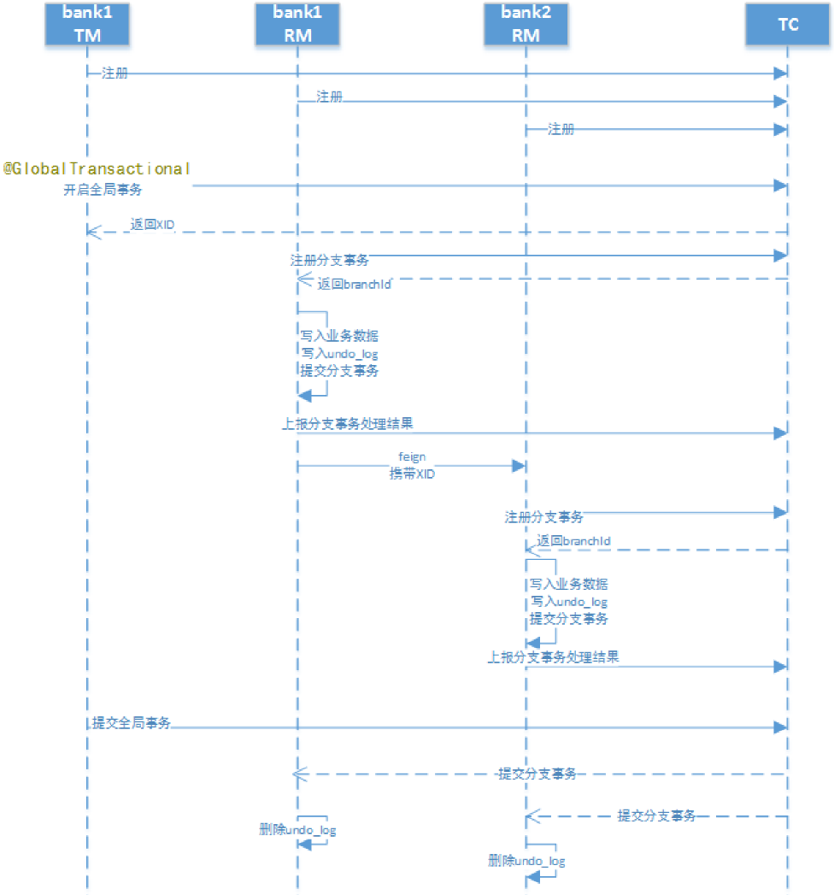
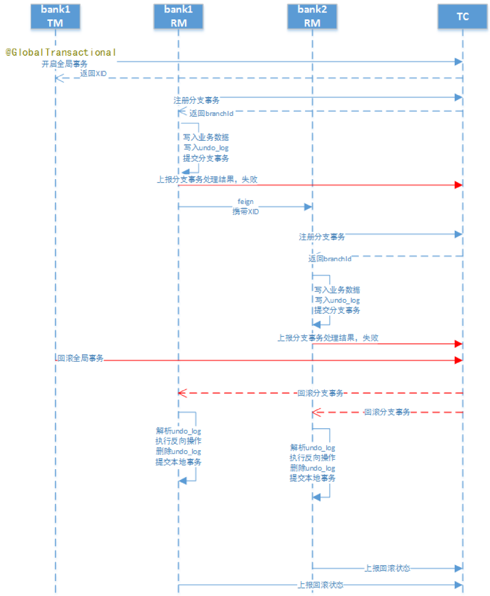

# seata实现2PC事务

## 业务说明

通过Seata中间件实现分布式事务，模拟三个账户的转账交易过程

两个账户在三个不同的银行（张三在bank1，李四在bank2），bank1和bank2是两个微服务。

交易过程：张三给李四转账指定金额。上述交易步骤，要么一起成功，要么一起失败，必须是一个整体性的事务

## 程序组成部分

数据库：MySQL-8.0.17；包括bank1和bank2两个数据库

JDK：1.8

微服务框架：spring-boot-2.1.3、spring-cloud-Greenwich.RELEASE

seata客户端（RM、TM）：spring-cloud-alibaba-seata-2.1.0.RELEASE

seata服务端（TC）：seata-server-0.7.1

## 配置

1. seata客户端的相关配置

在src/main/resource中，新增registry.conf、fifile.conf文件，内容可拷贝seata-server-0.7.1中的配置文件。 

在registry.conf中registry.type使用file（因为seata服务端的启动模式是file）：

在file.conf中

- 更改service.vgroup_mapping.[springcloud服务名]-fescar-service-group="default"
- 修改service.default.grouplist=[seata服务端地址]

2. 创建代理数据源

Seata的RM通过DataSourceProxy才能在业务代码的事务提交时，通过这个切入点与TC进行通信，记录undo_log等

```java
/**
     * 数据源代理
     * 在本地事务写入之后, RM的数据源代理会向undo_log写入相关回滚数据
     * @param ds0
     * @return
     */
@Primary
@Bean
public DataSource dataSource(DruidDataSource ds0)  {
  DataSourceProxy pds0 = new DataSourceProxy(ds0);
  return pds0;
}
```

## Seata执行流程

1. 正常流程



2. 回滚流程



1. 每个RM使用DataSourceProxy连接数据库，其目的是使用ConnectionProxy，使用数据源和数据连接代理的目的就是在第一阶段将undo_log和业务数据放在一个本地事务提交，这样就保存了只要有业务操作就一定有undo_log。 

2. 在第一阶段undo_log中存放了数据修改前和修改后的值，为事务回滚作好准备，所以第一阶段完成就已经将分支事务提交，也就释放了锁资源。 

3. TM开启全局事务开始，将XID全局事务id放在事务上下文中，通过feign调用也将XID传入下游分支事务，每个分支事务将自己的Branch ID分支事务ID与XID关联。 

4. 第二阶段全局事务提交，TC会通知各各分支参与者提交分支事务，在第一阶段就已经提交了分支事务，这里各参与者只需要删除undo_log即可，并且可以异步执行，第二阶段很快可以完成。 

5. 第二阶段全局事务回滚，TC会通知各各分支参与者回滚分支事务，通过 XID 和 Branch ID 找到相应的回滚日志，通过回滚日志生成反向的 SQL 并执行，以完成分支事务回滚到之前的状态，如果回滚失败则会重试回滚操作。