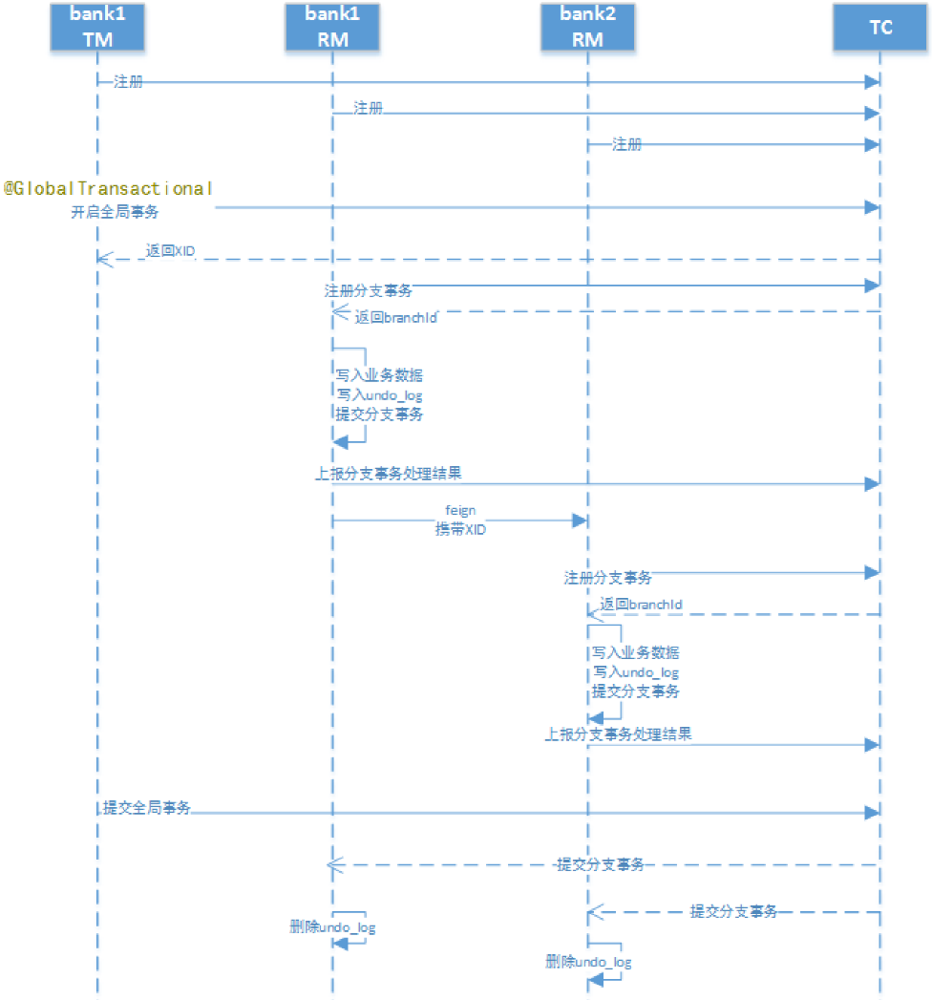
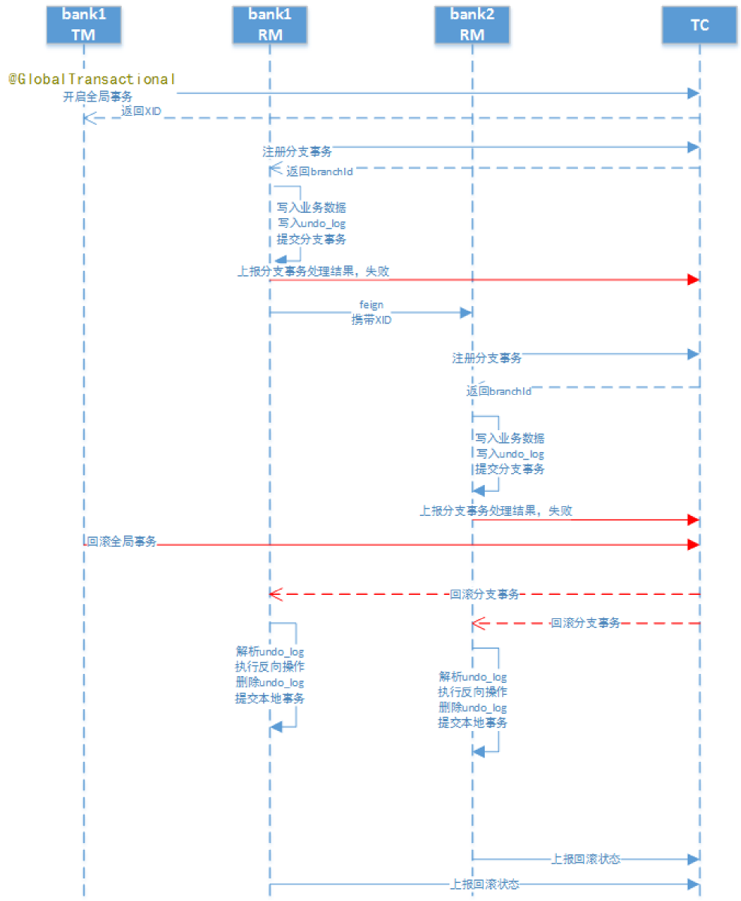
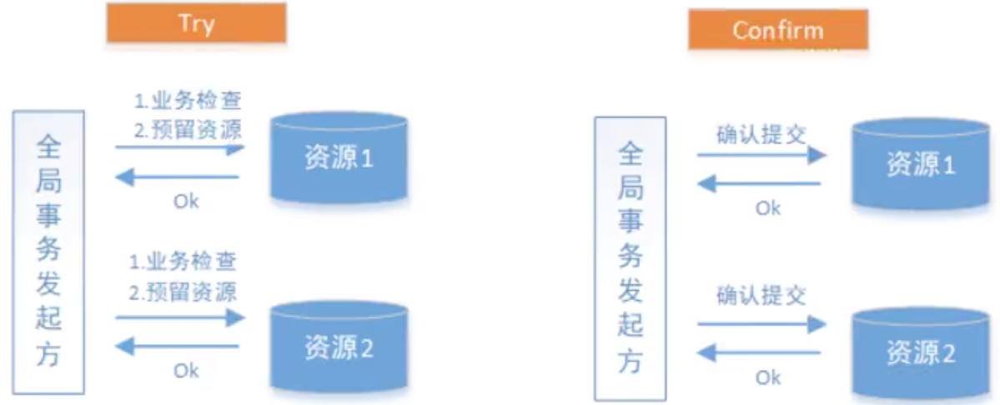

# seata实现2PC事务

## 业务说明

通过Seata中间件实现分布式事务，模拟三个账户的转账交易过程

两个账户在三个不同的银行（张三在bank1，李四在bank2），bank1和bank2是两个微服务。

交易过程：张三给李四转账指定金额。上述交易步骤，要么一起成功，要么一起失败，必须是一个整体性的事务

## 程序组成部分

数据库：MySQL-8.0.17；包括bank1和bank2两个数据库

JDK：1.8

微服务框架：spring-boot-2.1.3、spring-cloud-Greenwich.RELEASE

seata客户端（RM、TM）：spring-cloud-alibaba-seata-2.1.0.RELEASE

seata服务端（TC）：seata-server-0.7.1

## 配置

1. seata客户端的相关配置

在src/main/resource中，新增registry.conf、fifile.conf文件，内容可拷贝seata-server-0.7.1中的配置文件。 

在registry.conf中registry.type使用file（因为seata服务端的启动模式是file）：

在file.conf中

- 更改service.vgroup_mapping.[springcloud服务名]-fescar-service-group="default"
- 修改service.default.grouplist=[seata服务端地址]

2. 创建代理数据源

Seata的RM通过DataSourceProxy才能在业务代码的事务提交时，通过这个切入点与TC进行通信，记录undo_log等

```java
/**
     * 数据源代理
     * 在本地事务写入之后, RM的数据源代理会向undo_log写入相关回滚数据
     * @param ds0
     * @return
     */
@Primary
@Bean
public DataSource dataSource(DruidDataSource ds0)  {
  DataSourceProxy pds0 = new DataSourceProxy(ds0);
  return pds0;
}
```

## Seata执行流程

1. 正常流程



2. 回滚流程



1. 每个RM使用DataSourceProxy连接数据库，其目的是使用ConnectionProxy，使用数据源和数据连接代理的目的就是在第一阶段将undo_log和业务数据放在一个本地事务提交，这样就保存了只要有业务操作就一定有undo_log。 

2. 在第一阶段undo_log中存放了数据修改前和修改后的值，为事务回滚作好准备，所以第一阶段完成就已经将分支事务提交，也就释放了锁资源。 

3. TM开启全局事务开始，将XID全局事务id放在事务上下文中，通过feign调用也将XID传入下游分支事务，每个分支事务将自己的Branch ID分支事务ID与XID关联。 

4. 第二阶段全局事务提交，TC会通知各各分支参与者提交分支事务，在第一阶段就已经提交了分支事务，这里各参与者只需要删除undo_log即可，并且可以异步执行，第二阶段很快可以完成。 

5. 第二阶段全局事务回滚，TC会通知各各分支参与者回滚分支事务，通过 XID 和 Branch ID 找到相应的回滚日志，通过回滚日志生成反向的 SQL 并执行，以完成分支事务回滚到之前的状态，如果回滚失败则会重试回滚操作。

## 测试

1. 张三向李四转账成功
2. 李四事务失败，张三事务回滚成功
3. 张三事务失败，李四事务回滚成功
4. 分支事务超时测试

## 分布式事务解决方案之TCC

## 什么是TCC？（Try，Confirm，Cancel）

TCC要求每个分支事务实现三个操作：预处理Try，确认Confirm，撤销Cancel

- try - 业务检查和资源预留
- Confirm - 业务确认操作
- Cancel - 业务回滚操作

TM首先发起所有分支事务的try操作，任何一个分支事务的try操作失败，TM将会发起所有分支事务的Cancel操作，若try操作全部成功，TM将会发起所有分支事务的confirm操作，其中Confirm/Cancel操作若执行失败，TM会进行重试。

事务执行成功：



事务执行失败：


- 事务管理器（TM）

  可以实现为一个独立的服务，也可以让全局事务发起方充当TM的角色。TM在发起全局事务时生成全局事务记录，全局事务ID贯穿分布式事务调用链条，用来记录事务上下文，追踪和记录状态，由于Confirm和Cancel失败需要进行重试，因此处理接口需要保证幂等性。

TCC需要注意三种异常处理，分别是：空回滚，幂等和悬挂

1. 空回滚

   在没有调用TCC资源Try（资源还没有预留好）方法的情况下，调用了二阶段的Cancel方法，Cancel方法需要识别出这是一个空回滚，然后直接返回成功。

   **出现原因**：当一个分支事务所在服务宕机或者网络异常，分支事务调用记录为失败，这个时候其实是没有执行try阶段的，当故障恢复，分布式事务进行回滚会调用第二阶段的Cancel方法，从而形成空回滚

   **解决方案**：关键在于识别出这个空回滚。需要知道一阶段是否执行，如果执行了，那就是正常回滚；如果没有执行，那就是空回滚。因为TM在发起全局事务时生成了全局事务记录，全局事务Id贯穿整个分布式事务调用链条。所以我们可以**额外增加一张分支事务记录表**，其中有全局事务Id和分支事务ID，一阶段调用Try方法时会插入一条记录，表示一阶段执行了。Cancel接口里读取该记录，如果记录存在，则正常回滚；如果记录不存在，则空回滚。 

2. 幂等

   为了保证TCC二阶段提交重试机制不会引发数据不一致的问题，要求TCC的二阶段接口保证幂等，这样不会重复使用或者释放资源。

   **出现原因**：二阶段的Confirm或者Cancel方法有重试机制，如果方法不是幂等的，那么会造成数据不一致的问题

   **解决方案**：在分支事务记录表中增加执行状态，每次执行前都查询该状态。通过执行状态可以知道Confirm/Cancel到底有没有执行，如果执行过了，则不再重复执行同样的逻辑

3. 悬挂

   对于一个分布式系统，其二阶段Cancel接口比Try接口先执行。

   **出现原因**：在RPC调用分支事务try时，先注册分支事务，再执行RPC调用，如果RPC调用超时，TM就会通知RM回滚该分布式事务，可能回滚完成之后，RPC请求才到达参与者真正执行，而一个try方法预留的业务资源，只有该分布式事务才能使用，该分布式事务预留的一阶段的业务资源就再也没有人能处理了。这种情况称之为悬挂，即业务资源预留后没法继续处理

## 利用Hmily实现TCC事务

场景：模拟两个账户转账的场景。两个账户分别在两个不同的银行，bank1和bank2是两个微服务，bank1给bank2转账指定金额。上述交易步骤要么全部成功，要么全部失败

### 数据库

bank1和bank2对应的数据库都应当建立try，confirm，cancel三个日志表，用于记录事务操作日志。

日志表的作用主要用于解决以下问题：

1. **幂等性**（防止重复执行）
2. **空回滚**（防止执行cancel时，try还没有执行）
3. **悬挂**（防止执行try时，cancel或者confirm已经执行）

hmily会在程序启动时会在指定的数据库中创建两张表：

1. hmily-tcc-demo-bank1
2. hmily-tcc-demo-bank2

这两张表主要用于记录回滚时所需的一些数据，方便cancel时回滚

### 代码逻辑

#### bank1

##### try

1. 幂等性校验（判断try日志记录中是否存有对应事务id，如果有则直接返回）
2. 悬挂处理（判断confirm日志和cancel日志中是否存有对应事务id的记录，如果有则直接返回）
3. 扣钱
4. 记录try日志记录
5. 请求bank2微服务接口加钱

##### cancel

1. 幂等性校验
2. 空回滚校验（判断try日志记录是否有对应事务id的记录，如果没有，则直接返回）
3. 将扣的钱补回来
4. 记录cancel日志

##### confirm

空

#### bank2

##### try

空

##### cancel

空

##### confirm

1. 幂等性校验
2. 给账户加钱
3. 记录confirm日志记录

# 总结

2pc两阶段提交和TCC事务控制二者的区别可以看出：

1. TCC事务控制主要在代码层面进行控制，需要通过业务逻辑来实现。优势在于让应用自己定义数据操作的粒度，降低锁冲突，提高数据库吞吐量。但是代码侵入性太强，代码复杂。
2. 2PC事务控制主要在数据库层面进行控制，代码侵入性不强。

# RocketMQ实现可靠消息一致性事务

场景：通过RocketMQ实现可靠消息一致性事务，模拟两个账户的转账交易过程

