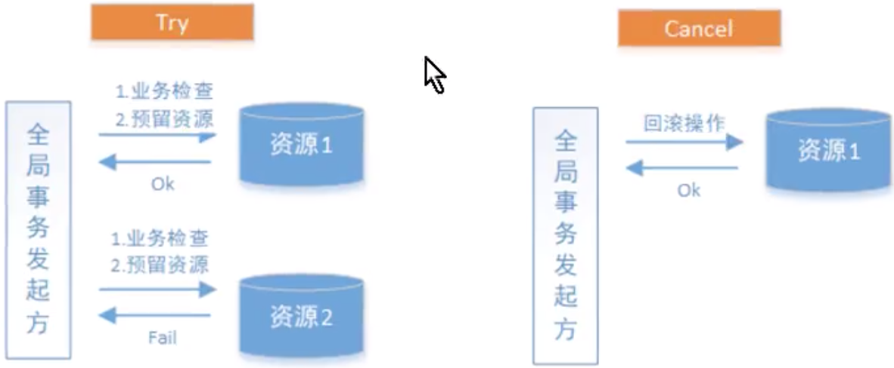

# seata实现2PC事务

## 业务说明

通过Seata中间件实现分布式事务，模拟三个账户的转账交易过程

两个账户在三个不同的银行（张三在bank1，李四在bank2），bank1和bank2是两个微服务。

交易过程：张三给李四转账指定金额。上述交易步骤，要么一起成功，要么一起失败，必须是一个整体性的事务

## 程序组成部分

数据库：MySQL-8.0.17；包括bank1和bank2两个数据库

JDK：1.8

微服务框架：spring-boot-2.1.3、spring-cloud-Greenwich.RELEASE

seata客户端（RM、TM）：spring-cloud-alibaba-seata-2.1.0.RELEASE

seata服务端（TC）：seata-server-0.7.1

## 配置

1. seata客户端的相关配置

在src/main/resource中，新增registry.conf、fifile.conf文件，内容可拷贝seata-server-0.7.1中的配置文件。 

在registry.conf中registry.type使用file（因为seata服务端的启动模式是file）：

在file.conf中

- 更改service.vgroup_mapping.[springcloud服务名]-fescar-service-group="default"
- 修改service.default.grouplist=[seata服务端地址]

2. 创建代理数据源

Seata的RM通过DataSourceProxy才能在业务代码的事务提交时，通过这个切入点与TC进行通信，记录undo_log等

```java
/**
     * 数据源代理
     * 在本地事务写入之后, RM的数据源代理会向undo_log写入相关回滚数据
     * @param ds0
     * @return
     */
@Primary
@Bean
public DataSource dataSource(DruidDataSource ds0)  {
  DataSourceProxy pds0 = new DataSourceProxy(ds0);
  return pds0;
}
```

## Seata执行流程

1. 正常流程


2. 回滚流程


1. 每个RM使用DataSourceProxy连接数据库，其目的是使用ConnectionProxy，使用数据源和数据连接代理的目的就是在第一阶段将undo_log和业务数据放在一个本地事务提交，这样就保存了只要有业务操作就一定有undo_log。 

2. 在第一阶段undo_log中存放了数据修改前和修改后的值，为事务回滚作好准备，所以第一阶段完成就已经将分支事务提交，也就释放了锁资源。 

3. TM开启全局事务开始，将XID全局事务id放在事务上下文中，通过feign调用也将XID传入下游分支事务，每个分支事务将自己的Branch ID分支事务ID与XID关联。 

4. 第二阶段全局事务提交，TC会通知各各分支参与者提交分支事务，在第一阶段就已经提交了分支事务，这里各参与者只需要删除undo_log即可，并且可以异步执行，第二阶段很快可以完成。 

5. 第二阶段全局事务回滚，TC会通知各各分支参与者回滚分支事务，通过 XID 和 Branch ID 找到相应的回滚日志，通过回滚日志生成反向的 SQL 并执行，以完成分支事务回滚到之前的状态，如果回滚失败则会重试回滚操作。

## 测试

1. 张三向李四转账成功
2. 李四事务失败，张三事务回滚成功
3. 张三事务失败，李四事务回滚成功
4. 分支事务超时测试

## 分布式事务解决方案之TCC

## 什么是TCC？（Try，Confirm，Cancel）

TCC要求每个分支事务实现三个操作：预处理Try，确认Confirm，撤销Cancel

- try - 业务检查和资源预留
- Confirm - 业务确认操作
- Cancel - 业务回滚操作

TM首先发起所有分支事务的try操作，任何一个分支事务的try操作失败，TM将会发起所有分支事务的Cancel操作，若try操作全部成功，TM将会发起所有分支事务的confirm操作，其中Confirm/Cancel操作若执行失败，TM会进行重试。

事务执行成功：


事务执行失败：



- 事务管理器（TM）

  可以实现为一个独立的服务，也可以让全局事务发起方充当TM的角色。TM在发起全局事务时生成全局事务记录，全局事务ID贯穿分布式事务调用链条，用来记录事务上下文，追踪和记录状态，由于Confirm和Cancel失败需要进行重试，因此处理接口需要保证幂等性。

TCC需要注意三种异常处理，分别是：空回滚，幂等和悬挂

1. 空回滚

   在没有调用TCC资源Try（资源还没有预留好）方法的情况下，调用了二阶段的Cancel方法，Cancel方法需要识别出这是一个空回滚，然后直接返回成功。

   **出现原因**：当一个分支事务所在服务宕机或者网络异常，分支事务调用记录为失败，这个时候其实是没有执行try阶段的，当故障恢复，分布式事务进行回滚会调用第二阶段的Cancel方法，从而形成空回滚

   **解决方案**：关键在于识别出这个空回滚。需要知道一阶段是否执行，如果执行了，那就是正常回滚；如果没有执行，那就是空回滚。因为TM在发起全局事务时生成了全局事务记录，全局事务Id贯穿整个分布式事务调用链条。所以我们可以**额外增加一张分支事务记录表**，其中有全局事务Id和分支事务ID，一阶段调用Try方法时会插入一条记录，表示一阶段执行了。Cancel接口里读取该记录，如果记录存在，则正常回滚；如果记录不存在，则空回滚。 

2. 幂等

   为了保证TCC二阶段提交重试机制不会引发数据不一致的问题，要求TCC的二阶段接口保证幂等，这样不会重复使用或者释放资源。

   **出现原因**：二阶段的Confirm或者Cancel方法有重试机制，如果方法不是幂等的，那么会造成数据不一致的问题

   **解决方案**：在分支事务记录表中增加执行状态，每次执行前都查询该状态。通过执行状态可以知道Confirm/Cancel到底有没有执行，如果执行过了，则不再重复执行同样的逻辑

3. 悬挂

   对于一个分布式系统，其二阶段Cancel接口比Try接口先执行。

   **出现原因**：在RPC调用分支事务try时，先注册分支事务，再执行RPC调用，如果RPC调用超时，TM就会通知RM回滚该分布式事务，可能回滚完成之后，RPC请求才到达参与者真正执行，而一个try方法预留的业务资源，只有该分布式事务才能使用，该分布式事务预留的一阶段的业务资源就再也没有人能处理了。这种情况称之为悬挂，即业务资源预留后没法继续处理

## 利用Hmily实现TCC事务

场景：模拟两个账户转账的场景。两个账户分别在两个不同的银行，bank1和bank2是两个微服务，bank1给bank2转账指定金额。上述交易步骤要么全部成功，要么全部失败

### 数据库

bank1和bank2对应的数据库都应当建立try，confirm，cancel三个日志表，用于记录事务操作日志。

日志表的作用主要用于解决以下问题：

1. **幂等性**（防止重复执行）
2. **空回滚**（防止执行cancel时，try还没有执行）
3. **悬挂**（防止执行try时，cancel或者confirm已经执行）

hmily会在程序启动时会在指定的数据库中创建两张表：

1. hmily-tcc-demo-bank1
2. hmily-tcc-demo-bank2

这两张表主要用于记录回滚时所需的一些数据，方便cancel时回滚

### 代码逻辑

#### bank1

##### try

1. 幂等性校验（判断try日志记录中是否存有对应事务id，如果有则直接返回）
2. 悬挂处理（判断confirm日志和cancel日志中是否存有对应事务id的记录，如果有则直接返回）
3. 扣钱
4. 记录try日志记录
5. 请求bank2微服务接口加钱

##### cancel

1. 幂等性校验
2. 空回滚校验（判断try日志记录是否有对应事务id的记录，如果没有，则直接返回）
3. 将扣的钱补回来
4. 记录cancel日志

##### confirm

空

#### bank2

##### try

空

##### cancel

空

##### confirm

1. 幂等性校验
2. 给账户加钱
3. 记录confirm日志记录

# 总结

2pc两阶段提交和TCC事务控制二者的区别可以看出：

1. TCC事务控制主要在代码层面进行控制，需要通过业务逻辑来实现。优势在于让应用自己定义数据操作的粒度，降低锁冲突，提高数据库吞吐量。但是代码侵入性太强，代码复杂。
2. 2PC事务控制主要在数据库层面进行控制，代码侵入性不强。

# RocketMQ实现可靠消息一致性事务

场景：通过RocketMQ实现可靠消息一致性事务，模拟两个账户的转账交易过程

# 案例：如何控制多线程事务？

**场景**：导入大批量数据的excel文件，解析之后需要写入数据库中，想要使用多线程对这个操作进行优化。但是可以注意到Spring是不支持多线程事务控制的，因为每一个线程的ThreadLocal都维护着自己的数据库连接，所以多线程情况下，spring的事务管理是不起作用的，应该如何处理？

**思路**：用两个CountDownLatch实现子线程的二段提交

**步骤**：

1. 主线程将要导入的大批量数据分发给指定数量（可以由自己定）的子线程，然后使用childMonitor.await()阻塞主线程，让主线程等待子线程的执行。并使用BlockingDeque来存储子线程的执行结果。
2. 子线程执行完毕之后调用childMonitor.countDown()，子线程的业务执行完毕之后，调用mainMonitor.await()阻塞每个子线程，等待主线程的执行；
3. 主线程被释放之后判断子线程的执行结果，如果发现有执行失败的情况，就需要将回滚状态置为true，并调用mainMonitor.countDown()释放所有子线程，子线程被释放后，根据回滚标志，如果是true那么就回滚，如果是false那么就提交事务。

**代码实现**：

RollBack.java - 回滚标志

```java
@Data
public class RollBack {
  private boolean needRollback;
  
  public RollBack(boolean needRollback) {
    this.needRollback = needRollback;
  }
}
```

ThreadPoolTool.java - 任务分发工具类

【注】子线程任务执行类实例是通过反射调用的，如果在子线程任务执行类中有用spring的依赖注入的话，将无法注入，需要把要注入的bean放在params中才行

```java
@Slf4j
public class ThreadPoolTool {
   /**
     * 执行多线程任务
     *
     * @param transactionManager 事务管理器
     * @param data               需要执行的数据集合
     * @param threadCount        核心线程数
     * @param params             备用参数
     * @param clazz              子线程实现类
     */
    public static void executeTask(DataSourceTransactionManager transactionManager, List data, int threadCount, Map params, Class clazz) {
        if (data == null || data.size() == 0) {
            return;
        }
        int batch = 0;
        // 创建指定线程数量的线程池
        ExecutorService executor = Executors.newFixedThreadPool(threadCount);
        //监控子线程的任务执行
        CountDownLatch childMonitor = new CountDownLatch(threadCount);
        //监控主线程，是否需要回滚
        CountDownLatch mainMonitor = new CountDownLatch(1);
        //存储任务的返回结果，返回true表示不需要回滚，反之，则回滚
        BlockingDeque<Boolean> results = new LinkedBlockingDeque<>(threadCount);
        RollBack rollback = new RollBack(false); // 回滚状态
        try {
            LinkedBlockingQueue<List<?>> linkedBlockingQueue = splitQueue(data, threadCount);
            while (true) {
                // 主线程将任务分发给子线程
                List taskList = linkedBlockingQueue.poll();
                batch++;
                params.put("batch", batch);
                if (taskList == null) break;
                Constructor constructor = clazz.getConstructor(CountDownLatch.class,
                        CountDownLatch.class,
                        BlockingDeque.class,
                        RollBack.class,
                        Object.class,
                        Map.class,
                        DataSourceTransactionManager.class);
                ThreadTask taskThread =
                        (ThreadTask) constructor.newInstance(childMonitor, mainMonitor, results, rollback, taskList, params, transactionManager);
                executor.execute(taskThread);
            }
            // 使用childMonitor.await();阻塞主线程，等待所有子线程处理向数据库中插入的业务。
            childMonitor.await();
            log.info("主线程开始执行任务");
            // 根据返回结果来确定是否回滚
            for (int i = 0; i < threadCount; i++) {
                boolean result = results.poll();
                if (!result) {
                    rollback.setNeedRollBack(true); // 需要回滚
                    break;
                }
            }
            // 主线程检查子线程执行任务的结果，若有失败结果出现，主线程标记状态告知子线程回滚，然后使用mainMonitor.countDown();
            // 将程序控制权再次交给子线程，子线程检测回滚标志，判断是否回滚。
            mainMonitor.countDown();
        } catch (Exception e) {
            e.printStackTrace();
        } finally {
            executor.shutdown();
        }
      
   /**
     * 分割队列, 队列中存放的是每一批次要处理的数据
     *
     * @param data        需要执行的数据集合
     * @param threadCount 核心线程数
     * @return
     */
    private static LinkedBlockingQueue<List<?>> splitQueue(List data, int threadCount) {
        LinkedBlockingQueue<List<?>> queue = new LinkedBlockingQueue<>();
        int dataTotalLen = data.size();
        int batchSize = dataTotalLen / threadCount; // 一批次处理多少数据
        int start, end;
        for (int i = 0; i < threadCount; i++) {
            start = i * batchSize; // data分割开始下标
            end = (i + 1) * batchSize; // data分割结束下标
            if (i < threadCount - 1) {
                queue.offer(data.subList(start, end));
            } else {
                queue.offer(data.subList(start, dataTotalLen));
            }
        }
        return queue;
    }
}
```

ThreadTask.java 子线程任务执行**抽象类**（提供了模板方法）

```java
/**
 * 子线程任务执行类
 *
 * @author :[ xuejz ]
 * @createTime :[ 2021/5/19 19:55 ]
 * @since :[ 1.0.0 ]
 */
@Slf4j
public abstract class ThreadTask implements Runnable {

    /**
     * 监控子线程任务的执行
     */
    private CountDownLatch childMonitor;

    /**
     * 监控主线程
     */
    private CountDownLatch mainMonitor;

    /**
     * 子线程执行结果
     */
    private BlockingDeque<Boolean> resultList;

    /**
     * 回滚标记类
     */
    private RollBack rollBack;

  	/**
  	 * 备用参数
  	 */
    private Map params;
    /**
     * 要处理的数据
     */
    private Object obj;
    
    /**
     * 事务管理器
     */
    protected DataSourceTransactionManager transactionManager;
    /**
     * 事务状态
     */
    protected TransactionStatus txStatus;

    public ThreadTask(CountDownLatch childMonitor,
                      CountDownLatch mainMonitor,
                      BlockingDeque<Boolean> resultList,
                      RollBack rollBack,
                      Map params,
                      Object obj,
                      DataSourceTransactionManager transactionManager) {
        this.childMonitor = childMonitor;
        this.mainMonitor = mainMonitor;
        this.resultList = resultList;
        this.rollBack = rollBack;
        this.params = params;
        this.obj = obj;
        this.transactionManager = transactionManager;
        initParam();
    }

    public abstract void initParam();

    /**
     * 执行任务, 返回false表示任务执行失败, 需要回滚
     */
    public abstract boolean processTask();
    /**
     * 事务回滚
     */
    private void rollback() {
        log.info("子线程[{}]开始回滚", Thread.currentThread().getName());
        transactionManager.rollback(txStatus);
    }

    /**
     * 事务提交
     */
    private void commit() {
        log.info("子线程[{}]提交事务", Thread.currentThread().getName());
        transactionManager.commit(txStatus);
    }

    protected Object getParam(String key) {
        return params.get(key);
    }

    @Override
    public void run() {
        log.info("子线程[{}]开始执行任务", Thread.currentThread().getName());
        DefaultTransactionDefinition def = new DefaultTransactionDefinition();
        def.setPropagationBehavior(TransactionDefinition.PROPAGATION_REQUIRED);
        txStatus = transactionManager.getTransaction(def);
        Boolean result = processTask();
        //向队列中添加处理结果
        resultList.offer(result);
        // 使用childMonitor.countDown()释放子线程锁定
        // 同时使用mainMonitor.await();阻塞子线程，将程序的控制权交还给主线程。
        childMonitor.countDown();
        try {
            //等待主线程的判断逻辑执行完，执行下面的是否回滚逻辑
            mainMonitor.await();
        } catch (InterruptedException e) {
            log.error(e.getMessage());
        }
        // 主线程检查子线程执行任务的结果，若有失败结果出现，主线程标记状态将告知子线程回滚，然后使用mainMonitor.countDown();
        // 将程序控制权再次交给子线程，子线程检测回滚标志，判断是否回滚。
        log.info("主线程的判断逻辑执行完成, 子线程[{}]继续执行剩下的任务", Thread.currentThread().getName());
        if(rollBack.isNeedRollBack()) {
            rollback();
        } else {
            commit();
        }
    }
}
```

子线程任务类

```java
@Slf4j
public class AddAccountInfoBatch extends ThreadTask {

    /**
     * 要处理的数据
     */
    private List<AccountInfo> data;

    /**
     * 无法通过spring的依赖注入来注入, 需要通过params来获得
     */
    private AccountInfoDao accountInfoDao;

    public AddAccountInfoBatch(CountDownLatch childMonitor,
                               CountDownLatch mainMonitor,
                               BlockingDeque resultList,
                               RollBack rollBack,
                               Object obj,
                               Map params,
                               DataSourceTransactionManager transactionManager) {
        super(childMonitor, mainMonitor, resultList, rollBack, params, obj, transactionManager);
        data = (List<AccountInfo>) obj;
    }

    @Override
    public void initParam() {
        accountInfoDao = (AccountInfoDao) getParam("accountInfoDao");
    }

    @Override
    public boolean processTask() {
        log.info("子线程[{}]执行业务逻辑", Thread.currentThread().getName());
        try {
            if (data.get(0).getAccountBalance() == 10) {
                throw new RuntimeException("人工制造异常 - 回滚");
            }
            int i = accountInfoDao.addAccountBatch(data);
            return i == data.size();
        } catch (Exception e) {
            e.printStackTrace();
            return false;
        }
    }
}
```

Service层方法

```java
@Override
public void insertAccountInfoBatch(List<AccountInfo> accountInfos) {
  try {
    int threadCount = 3; // 线程数量
    Map params = new HashMap();
    params.put("accountInfoDao", accountInfoDao); // 把dao层放到params中, 不然在ThreadTask中注不进去, 因为任务分配类是通过反射创建的子线程任务执行类的实例
    ThreadPoolTool.executeTask(transactionManager, accountInfos, threadCount, params, AddAccountInfoBatch.class);
  } catch (Exception e) {
    throw new RuntimeException(e.getMessage());
  }
}
```

